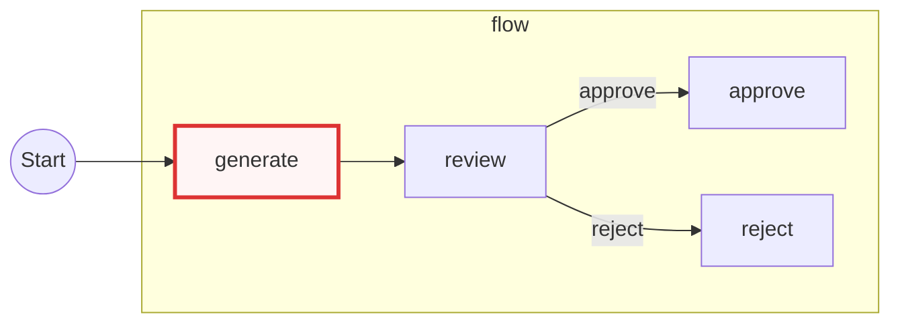

# Built-in Flow Visualization

PocketFlow now provides a built-in `Flow.visualize()` API for exporting the connected workflow graph as Mermaid.

The visualization step is structural only. It reads graph topology (`start_node` and `successors`) and **does not execute** node logic.

## Quick Start

```python
from pocketflow import Node, Flow

class Generate(Node):
    pass

class Review(Node):
    pass

class Approve(Node):
    pass

class Reject(Node):
    pass

generate = Generate()
review = Review()
approve = Approve()
reject = Reject()

generate >> review
review - "approve" >> approve
review - "reject" >> reject

flow = Flow(start=generate)
mermaid = flow.visualize(namespace=locals(), direction="LR")
print(mermaid)
```

Example output:



## API

```python
Flow.visualize(
    namespace: dict,
    *,
    direction: str = "LR",
    show_default: bool = False,
    highlight_starts: bool = True,
    max_nodes: int = 1000,
) -> str
```

### Parameters

- `namespace`: mapping from variable name to object reference (recommended: `locals()`).
- `direction`: Mermaid direction (`LR`, `RL`, `TB`, `TD`, `BT`).
- `show_default`: when `True`, default edges are rendered as `|default|` labels.
- `highlight_starts`: when `True`, highlights resolved start nodes for entry flow and nested flows.
- `max_nodes`: traversal limit to prevent oversized or cyclic expansion.

## Warnings and Fallbacks

- Missing or invalid `namespace` triggers a warning and falls back to class-name labels.
- Multiple variable names pointing to the same object trigger a warning; the lexicographically smallest name is used.

## Notes and Limits

- This output is Mermaid markdown text only; rendering depends on your markdown renderer.
- The built-in output targets graph inspection and documentation, not runtime tracing.

For interactive D3-based visualization, see the cookbook: [pocketflow-visualization](https://github.com/The-Pocket/PocketFlow/tree/main/cookbook/pocketflow-visualization).
